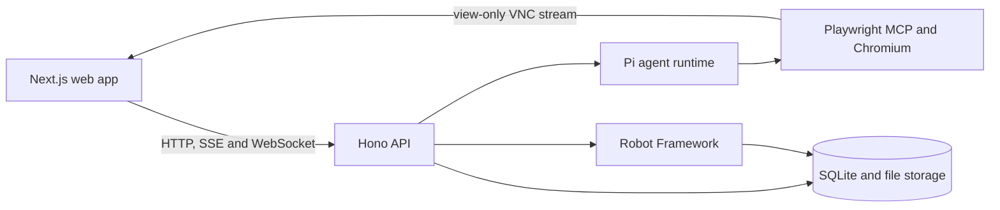

<div align="center">
  
  <h1>Specbook</h1>
  <p><strong>Git-backed, executable specifications for web applications.</strong></p>
  <p>
    <a href="https://github.com/gustavo-ferreira03/specbook/actions/workflows/publish-image.yml"></a>
    <a href="LICENSE"></a>
    <a href="https://github.com/gustavo-ferreira03/specbook/pkgs/container/specbook"></a>
  </p>
  <p><a href="#run-it">Run it</a> &bull; <a href="#what-you-get">What you get</a> &bull; <a href="#development">Development</a> &bull; <a href="#configuration">Configuration</a></p>
</div>

Specbook turns a conversation about application behavior into a durable Spec that people can read, edit, review in Git, and run again. The agent works in a visible Chromium window while Robot Framework executes the saved check.

It is self-hosted. Your projects, credentials, chat history, source files, run evidence, and browser state stay in your own storage volume.

## Run it

You need [Docker Compose](https://docs.docker.com/compose/). The published image includes Chromium, Playwright MCP, Robot Framework, Browser Library, Xvfb, and x11vnc.

Download the Compose file and start Specbook:

```bash
curl -O https://raw.githubusercontent.com/gustavo-ferreira03/specbook/main/docker-compose.yml
docker compose up -d
```

Open [http://localhost:4001](http://localhost:4001). In **Settings**, connect an LLM provider and select a model. Specbook accepts API keys from its model registry plus OAuth connections for Anthropic, OpenAI Codex, and GitHub Copilot.

The frontend uses port `4001`; the internal API uses `4000`. Confirm that the service started:

```bash
curl http://localhost:4000/health
```

Compose persists all state in the named `specbook-storage` volume. Updating the image does not remove it:

```bash
docker compose pull
docker compose up -d
```

To build the image from a checkout instead of pulling GHCR:

```bash
docker build --build-arg NEXT_PUBLIC_API_URL=http://localhost:4000 -t specbook:local .
SPECBOOK_IMAGE=specbook:local docker compose up -d
```

> [!WARNING]
> Specbook has no application-level authentication. Compose exposes the frontend, API, and OAuth callback ports on every host interface. Run it on a trusted network, or place it behind a firewall, VPN, IP allowlist, or authenticated reverse proxy.

> [!WARNING]
> Chat content is stored in Specbook's persistent storage and sent to the selected LLM provider. Never paste passwords, verification codes, private keys, or application tokens into chat.

## What you get

- **Visible browser work.** Describe a flow while the agent inspects the application in a headed Chromium session that you can watch.
- **Guided discovery.** Let the agent map areas, terminology, roles, rules, and unknowns before it writes a Spec.
- **Readable files.** A Spec has a YAML document for its behavior and a Robot Framework file for execution. The UI exposes both for direct edits.
- **Git as the source of truth.** Each project gets its own repository. Specs, Features, and confirmed context live in ordinary files, while SQLite indexes them for the application.
- **Execution evidence.** Run one Spec, a Feature subtree, or a project; inspect status, duration, logs, Robot reports, screenshots, and failure video where available.

## How it works

1. Create a project with the application's base URL.
2. Start discovery or a Spec chat. Discovery stays inside the project's origin and only performs read-oriented navigation.
3. Describe a behavior while the agent uses the visible browser and asks for the details it needs.
4. Review the generated files, commit their history in the project repository, then run the Spec whenever the application changes.

The project repository under `storage/repos/<project-id>` has this shape:

```text
context.yml
features/<feature>/feature.yml
specs/<feature>/<spec>/spec.yml
specs/<feature>/<spec>/spec.robot
```

> [!NOTE]
> Discovery has an origin guard, action budget, deny list, and safety instructions. It is not a network sandbox, so prefer a disposable or staging application.

## Architecture



| Part | Responsibility |
| --- | --- |
| `apps/frontend` | Next.js 15 and React 19 interface, including chat, Spec pages, settings, and the noVNC browser viewer |
| `apps/backend` | Hono API, SSE chat updates, WebSocket VNC proxy, LLM sessions, browser lifecycle, Git repositories, and run orchestration |
| Playwright MCP | Headed Chromium used by the agent while exploring and authoring |
| Robot Framework | Executes saved Specs with Browser Library and writes reports and evidence |
| Git and libSQL / SQLite | Git stores project files; SQLite indexes projects, Features, Specs, runs, and model selection |

By default, local data lives in `apps/backend/storage`:

```text
storage/
├── specbook.db       # Application database
├── pi-auth.json      # LLM provider credentials
├── chat/             # Chat sessions and browser profiles
├── repos/            # One Git repository per project
└── runs/             # Reports, logs, screenshots, video, and batch state
```

## Development

Local development targets Linux because headed browser sessions depend on Xvfb and x11vnc. Install:

- Node.js 22.19 or newer
- pnpm 10.30.1
- Python 3 with virtual environment support
- Xvfb and x11vnc

Install packages and the Chromium revision used by Playwright MCP:

```bash
pnpm install
pnpm --filter backend browser:install
```

On Debian or Ubuntu, install the display and VNC processes:

```bash
sudo apt-get install xvfb x11vnc
```

Create the Python environment for Robot Framework and Browser Library:

```bash
python3 -m venv .venv
source .venv/bin/activate
pip install -r requirements.txt
rfbrowser init chromium
```

Apply database migrations, then start both applications:

```bash
pnpm --filter backend db:migrate
pnpm dev
```

The backend starts on port `4000`; the frontend starts on port `4001`. Keep the Python environment active so the backend can find the `robot` executable.

### Development commands

| Task | Command |
| --- | --- |
| Start both workspaces | `pnpm dev` |
| Type-check the backend | `pnpm --filter backend exec tsc --noEmit` |
| Build the backend | `pnpm --filter backend build` |
| Build the frontend | `pnpm --filter frontend build` |
| Install the Playwright MCP browser | `pnpm --filter backend browser:install` |
| Generate a database migration | `pnpm --filter backend db:generate` |
| Apply database migrations | `pnpm --filter backend db:migrate` |

After changing `apps/backend/src/infra/db/schema.ts`, generate a migration and commit the resulting files under `apps/backend/drizzle`. Read [CONTRIBUTING.md](CONTRIBUTING.md) before opening a pull request.

## Configuration

| Variable | Default | Purpose |
| --- | --- | --- |
| `NEXT_PUBLIC_API_URL` | `http://localhost:4000` | Public backend URL used by the frontend for HTTP and WebSocket requests. Set it before building the frontend. |
| `FRONTEND_ORIGIN` | `http://localhost:4001` | Frontend origin allowed by backend CORS and VNC WebSocket checks. |
| `HOST` | `127.0.0.1` | Backend bind address. Docker Compose sets it to `0.0.0.0`. |
| `PORT` | `4000` | Backend HTTP and WebSocket port. |
| `SPECBOOK_STORAGE_DIR` | `apps/backend/storage` | Directory for the database, credentials, chats, Specs, and run artifacts. |

For a deployment with public URLs, build an image with the public API URL and set the backend's allowed frontend origin:

```bash
docker build \
  --build-arg NEXT_PUBLIC_API_URL=https://specbook-api.example.com \
  -t specbook:public .

SPECBOOK_IMAGE=specbook:public \
FRONTEND_ORIGIN=https://specbook.example.com \
docker compose up -d
```

> [!IMPORTANT]
> `NEXT_PUBLIC_API_URL` is embedded in the frontend build. Rebuild the image after changing it.

## Operational notes

- A single Spec run times out after 120 seconds.
- Batch timeouts scale with the number of Specs and stop at 30 minutes.
- Browser profiles persist per chat, including cookies and authenticated state, until the chat is deleted.
- The HTTP API is internal and unversioned; only the `/health` endpoint is intended as an operational check.
