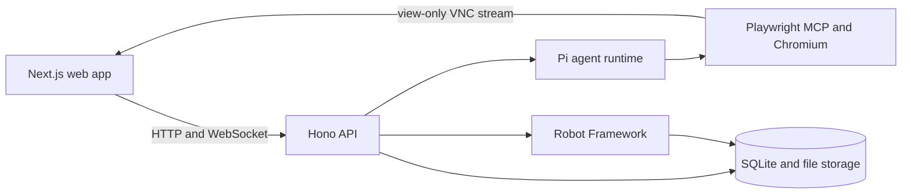

<div align="center">
  
  <h1>Specbook</h1>
  <p><strong>Living, executable specs for web applications.</strong></p>
  <p><a href="#quick-start">Quick start</a> &bull; <a href="#how-it-works">How it works</a> &bull; <a href="#local-development">Development</a> &bull; <a href="#configuration">Configuration</a></p>
</div>

Specbook turns conversations about web application behavior into permanent, human-readable Specs. An AI agent explores your application in a visible Chromium window, asks for missing details, and creates executable checks without exposing test code in the normal workflow.

Each Spec records its preconditions, steps, expected result, postconditions, verification status, immutable versions, run history, and evidence. Specbook is self-hosted and built for independent developers and small software teams.

## Features

- **Browser-assisted authoring.** Watch the agent navigate and inspect the application while you describe a behavior in chat.
- **Readable Specs.** Keep the expected behavior in plain language while Robot Framework runs behind the interface.
- **Guided project discovery.** Let the agent map an application's areas, terms, roles, rules, and open questions; review the draft before later conversations can use it.
- **Recorded verification.** Inspect status, duration, failure details, screenshots, logs, Robot reports, and failure video where available.
- **Single or batch runs.** Run one Spec, a Feature subtree, or the whole project in one Robot suite and one shared report.
- **Local ownership.** Store projects, conversations, browser profiles, provider credentials, Specs, and run artifacts on your own machine.

## Quick start

You need [Docker Compose](https://docs.docker.com/compose/).

```bash
docker compose up --build
```

Open [http://localhost:4001](http://localhost:4001), then go to **Settings** to connect an LLM provider and select a model. Specbook accepts API keys from its model registry and OAuth connections for Anthropic, OpenAI Codex, and GitHub Copilot.

The API listens on [http://localhost:4000](http://localhost:4000). You can check it with:

```bash
curl http://localhost:4000/health
```

Docker Compose keeps the database and generated files in the `specbook-storage` volume. Rebuilding or replacing the container won't remove that volume.

> [!WARNING]
> Specbook has no application-level authentication. Docker Compose publishes the frontend, API, and OAuth callback ports on every host interface, so run it only on a trusted network or place it behind a firewall, VPN, IP allowlist, or authenticated reverse proxy.

> [!WARNING]
> Conversation content is stored in Specbook's persistent storage and sent to the selected LLM provider. Never paste passwords, verification codes, private keys, or application tokens into chat.

## How it works

1. **Create a project** with the application's name and base URL.
2. **Choose whether to explore first.** Guided discovery browses the application and drafts reusable project context. You can also skip it and start immediately.
3. **Describe one behavior** in a conversation while the agent operates the live browser.
4. **Review the generated Spec.** Once the behavior is clear, the agent saves an immutable version and runs its Robot Framework executable.
5. **Keep checking it.** Rerun the Spec from its page, run a Feature subtree, or execute the whole project; status and evidence remain attached to each Spec.

### Guided discovery

Discovery can navigate, read, and follow safe links within the project's origin. It can't type into forms, accept dialogs, create Features or Specs, or trigger actions that change application data. Authentication walls remain unknown until protected credential entry is available.

The resulting context covers the application summary, areas, terminology, roles, business rules, UI patterns, execution notes, unknowns, and source pages. It remains a draft until you edit and confirm it; only the latest confirmed revision reaches future Spec conversations.

> [!NOTE]
> Discovery's origin guard, action budget, deny list, and safety instructions reduce accidental actions, but they aren't a network sandbox. Use a disposable or staging environment when possible.

## Architecture



| Part | Responsibility |
| --- | --- |
| `apps/frontend` | Next.js 15 and React 19 interface, including chat, Spec pages, settings, and the noVNC browser viewer |
| `apps/backend` | Hono REST API, WebSocket VNC proxy, LLM sessions, browser lifecycle, repositories, and run orchestration |
| Playwright MCP | Headed Chromium used by the agent while exploring and authoring |
| Robot Framework | Executes saved Specs with Browser Library and writes reports and evidence |
| libSQL / SQLite | Stores projects, Features, Specs, versions, runs, and model selection |

By default, local data lives in `apps/backend/storage`:

```text
storage/
├── specbook.db       # Application database
├── pi-auth.json      # LLM provider credentials
├── chat/             # Conversation sessions and browser profiles
├── specs/            # Immutable Robot Framework source versions
└── runs/             # Reports, logs, screenshots, video, and batch state
```

## Local development

Local development currently targets Linux because headed browser sessions depend on Xvfb and x11vnc. Install:

- Node.js 22.19 or newer
- pnpm 10.30.1
- Python 3 with virtual environment support
- Xvfb and x11vnc

Install the JavaScript packages and the Chromium revision used by Playwright MCP:

```bash
pnpm install
pnpm --filter backend browser:install
```

On Debian or Ubuntu, install the display and VNC processes:

```bash
sudo apt-get install xvfb x11vnc
```

Set up Robot Framework and Browser Library:

```bash
python3 -m venv .venv
source .venv/bin/activate
pip install -r requirements.txt
rfbrowser init chromium
```

Apply the database migrations, then start both applications:

```bash
pnpm --filter backend db:migrate
pnpm dev
```

The backend starts on port `4000`; the frontend starts on port `4001`. Keep the Python environment active so the backend can find the `robot` executable.

### Development commands

| Task | Command |
| --- | --- |
| Start both workspaces | `pnpm dev` |
| Type-check the backend | `pnpm --filter backend exec tsc --noEmit` |
| Build the backend | `pnpm --filter backend build` |
| Build the frontend | `pnpm --filter frontend build` |
| Install the Playwright MCP browser | `pnpm --filter backend browser:install` |
| Generate a database migration | `pnpm --filter backend db:generate` |
| Apply database migrations | `pnpm --filter backend db:migrate` |

After changing `apps/backend/src/infra/db/schema.ts`, generate a migration and commit the resulting files under `apps/backend/drizzle`.

## Configuration

| Variable | Default | Purpose |
| --- | --- | --- |
| `NEXT_PUBLIC_API_URL` | `http://localhost:4000` | Public backend URL used by the frontend for HTTP and WebSocket requests. Set it before building the frontend. |
| `FRONTEND_ORIGIN` | `http://localhost:4001` | Frontend origin allowed by backend CORS and VNC WebSocket checks. |
| `HOST` | `127.0.0.1` | Backend bind address. Docker Compose sets it to `0.0.0.0`. |
| `PORT` | `4000` | Backend HTTP and WebSocket port. |
| `SPECBOOK_STORAGE_DIR` | `apps/backend/storage` | Directory for the database, credentials, conversations, Specs, and run artifacts. |

For a deployment with public URLs, pass both origins when building and starting Compose:

```bash
NEXT_PUBLIC_API_URL=https://specbook-api.example.com \
FRONTEND_ORIGIN=https://specbook.example.com \
docker compose up --build
```

> [!IMPORTANT]
> `NEXT_PUBLIC_API_URL` is embedded in the frontend build. Rebuild the image after changing it.

## Operational notes

- A single Spec run times out after 120 seconds.
- Batch timeouts scale with the number of Specs and stop at 30 minutes.
- Browser profiles persist per conversation, including cookies and authenticated state, until the conversation is deleted.
- The HTTP API is internal and unversioned; only the `/health` endpoint is intended as an operational check.
