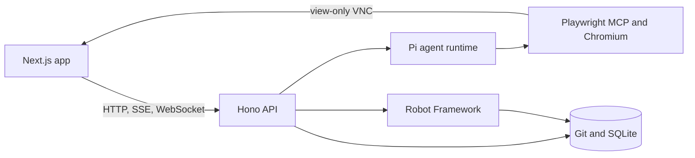

<div align="center">
  
  <h1>Specbook</h1>
  <p><strong>Git-backed, executable specifications for web applications.</strong></p>
  <p>
    <a href="https://github.com/gustavo-ferreira03/specbook/actions/workflows/publish-image.yml"></a>
    <a href="https://github.com/gustavo-ferreira03/specbook/pkgs/container/specbook"></a>
    <a href="LICENSE"></a>
    
  </p>
  <p><a href="#quick-start">Quick start</a> &bull; <a href="#how-it-works">How it works</a> &bull; <a href="#configuration">Configuration</a> &bull; <a href="#development">Development</a></p>
</div>

Specbook turns a conversation about web application behavior into a readable Spec that your team can run again. Describe a flow in chat, watch the agent inspect the application in a visible Chromium session, then review the YAML and Robot Framework files it writes.

Each project has its own Git repository. Specs, Features, and confirmed project context live as ordinary files; SQLite indexes them so the app can search, display, and run them quickly.

## Quick start

You need [Docker](https://docs.docker.com/get-docker/). The public image includes Chromium, Playwright MCP, Robot Framework, Browser Library, Xvfb, and x11vnc.

```bash
docker run --detach \
  --name specbook \
  --restart unless-stopped \
  --init \
  --shm-size=1g \
  -p 4000:4000 \
  -p 4001:4001 \
  -p 53692:53692 \
  -e HOST=0.0.0.0 \
  -e FRONTEND_ORIGIN=http://localhost:4001 \
  -e PI_OAUTH_CALLBACK_HOST=0.0.0.0 \
  -v specbook-storage:/app/apps/backend/storage \
  ghcr.io/gustavo-ferreira03/specbook:latest
```

Open [http://localhost:4001](http://localhost:4001), then connect an LLM provider in **Settings**. Specbook supports API keys from its model registry and OAuth connections for Anthropic, OpenAI Codex, and GitHub Copilot.

```bash
curl http://localhost:4000/health
docker logs -f specbook
```

> [!TIP]
> The named `specbook-storage` volume keeps your data after you remove or replace the container. Docker does not remove named volumes unless you ask it to.

> [!WARNING]
> Specbook has no application-level authentication. The default Docker command exposes the frontend, API, and OAuth callback ports on every host interface. Use a trusted network, or place it behind a firewall, VPN, IP allowlist, or authenticated reverse proxy.

## How it works

1. Create a project with the application's base URL.
2. Start guided discovery to collect areas, terminology, roles, and rules, or go directly to a Spec chat.
3. Describe one behavior while the agent uses the visible browser and asks for missing details.
4. Review the generated files, inspect the Git history, and run the Spec when the application changes.

Discovery stays within the project origin and only follows read-oriented browser actions. It has an origin guard, action budget, deny list, and safety instructions, but it is not a network sandbox.

> [!NOTE]
> Use a disposable or staging application whenever possible. Do not enter passwords, private keys, one-time codes, or production tokens into a chat.

## What gets stored

Specbook stores data in `apps/backend/storage` locally, or in `/app/apps/backend/storage` inside the container.

```text
storage/
├── specbook.db       # SQLite index and application state
├── pi-auth.json      # LLM provider credentials
├── chat/             # Chat sessions and browser profiles
├── repos/            # One Git repository per project
└── runs/             # Reports, logs, screenshots, video, and batch state
```

A project repository keeps its source in a familiar layout:

```text
context.yml
features/<feature>/feature.yml
specs/<feature>/<spec>/spec.yml
specs/<feature>/<spec>/spec.robot
```

`spec.yml` holds the human-facing behavior and `spec.robot` executes it. The directory path and slug identify the Spec; YAML files do not carry database IDs.

## Architecture

| Part | Purpose |
| --- | --- |
| `apps/frontend` | Next.js 15 and React 19 interface, including chats, Specs, settings, and the noVNC browser viewer |
| `apps/backend` | Hono API, SSE chat updates, VNC proxy, browser lifecycle, Git repositories, and run orchestration |
| Playwright MCP | Headed Chromium used during discovery and Spec authoring |
| Robot Framework | Executes saved Specs with Browser Library and writes evidence |
| Git + libSQL / SQLite | Git stores project files; SQLite indexes the application state |



## Configuration

| Variable | Default | Purpose |
| --- | --- | --- |
| `NEXT_PUBLIC_API_URL` | `http://localhost:4000` | Public API URL embedded into the frontend at image build time |
| `FRONTEND_ORIGIN` | `http://localhost:4001` | Frontend origin accepted by CORS and VNC WebSocket checks |
| `HOST` | `127.0.0.1` | Backend bind address; Compose sets `0.0.0.0` |
| `PORT` | `4000` | Backend HTTP and WebSocket port |
| `SPECBOOK_STORAGE_DIR` | `apps/backend/storage` | Directory for data, credentials, project repositories, and run artifacts |

For a deployment with separate public frontend and API URLs, build a local image with the API URL and set the browser origin at runtime:

```bash
docker build \
  --build-arg NEXT_PUBLIC_API_URL=https://specbook-api.example.com \
  -t specbook:public .

docker run --detach \
  --name specbook \
  --restart unless-stopped \
  --init \
  --shm-size=1g \
  -p 4000:4000 \
  -p 4001:4001 \
  -p 53692:53692 \
  -e HOST=0.0.0.0 \
  -e FRONTEND_ORIGIN=https://specbook.example.com \
  -e PI_OAUTH_CALLBACK_HOST=0.0.0.0 \
  -v specbook-storage:/app/apps/backend/storage \
  specbook:public
```

## Development

Local development targets Linux because agent browser sessions need Xvfb and x11vnc. Install Node.js 26, pnpm 10.30.1, Python 3 with virtual environments, Xvfb, and x11vnc.

```bash
pnpm install
pnpm --filter backend browser:install

python3 -m venv .venv
source .venv/bin/activate
pip install -r requirements.txt
rfbrowser init chromium

pnpm --filter backend db:migrate
pnpm dev
```

The backend listens on `4000` and the frontend on `4001`. Keep the Python environment active so the backend can find the `robot` executable.

| Task | Command |
| --- | --- |
| Type-check the backend | `pnpm --filter backend exec tsc --noEmit` |
| Build the backend | `pnpm --filter backend build` |
| Build the frontend | `pnpm --filter frontend build` |
| Install the MCP browser | `pnpm --filter backend browser:install` |
| Create a database migration | `pnpm --filter backend db:generate` |
| Apply database migrations | `pnpm --filter backend db:migrate` |

## Operational notes

- A single Spec run times out after 120 seconds.
- Batch timeouts scale with the number of Specs and stop at 30 minutes.
- Browser profiles retain cookies and authenticated state until the related chat is deleted.
- The HTTP API is internal and unversioned. Use `/health` only as an operational check.

Questions, ideas, and bug reports belong in [GitHub Discussions](https://github.com/gustavo-ferreira03/specbook/discussions) and [Issues](https://github.com/gustavo-ferreira03/specbook/issues).
