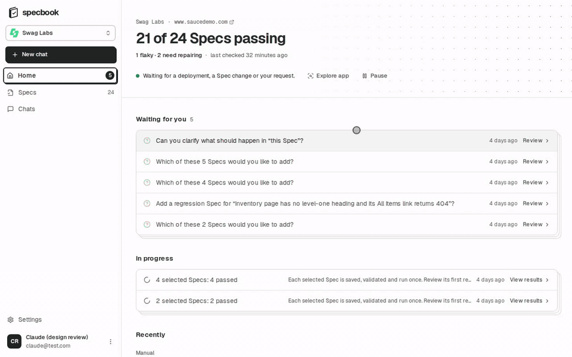

<!-- prettier-ignore -->
<div align="center">

<h1> specbook</h1>

*A self-hosted QA agent that turns plain-language behavior into Playwright tests you can read.*

[](https://github.com/gustavo-ferreira03/specbook/actions/workflows/ci.yml)
[](https://github.com/gustavo-ferreira03/specbook/pkgs/container/specbook)

[](https://www.typescriptlang.org)
[](LICENSE)

[Features](#features) • [Get started](#get-started) • [How it works](#how-it-works) • [Coding agents](#connect-your-coding-agent) • [CI](#run-checks-from-ci) • [Configuration](#configuration-and-data) • [Development](#develop-locally)



</div>

Describe a flow in chat, and Specbook explores your app in a real browser, writes a **Spec** (a readable contract plus a Playwright test), runs it and keeps the evidence. When a Spec fails, the agent investigates in a browser you can watch and proposes a repair that keeps the intended behavior.

## Features

- **Specs people can read**: every check is a `spec.yml` with steps and an expected result, paired with an executable `spec.ts`.
- **An agent that does the legwork**: it maps your app, proposes Specs, signs in with stored credentials and asks only when it is blocked.
- **Evidence for every run**: screenshots per step, video on failure, diagnostics and run history live next to the Spec.
- **QA for your coding agent**: Claude Code or any MCP client can ask Specbook to verify a change, as a QA subagent.
- **Checks on every deploy**: schedules and CI pipelines run saved Specs, with JUnit and Markdown reports and pull request comments.
- **Yours to host**: one container, your model provider, credentials encrypted at rest and projects stored in Git.

## Get started

With [Docker](https://docs.docker.com/get-docker/) installed, run:

```sh
docker run -d --name specbook --restart unless-stopped \
  -p 127.0.0.1:4001:4001 -v specbook:/data \
  ghcr.io/gustavo-ferreira03/specbook
```

Open [localhost:4001](http://localhost:4001). The setup wizard creates the admin account, connects a model provider and adds your first project; the bundled Sauce Demo project is a quick way to try it.

The container holds everything: the web app, the agent, both browsers and the test runner. Data lives in the `specbook` volume, so updating is a `docker pull` and a new `docker run` with the same volume.

> [!TIP]
> To serve Specbook on a domain, point your reverse proxy at port 4001 and add `-e FRONTEND_ORIGIN=https://specbook.example.com`. Extra hostnames go in `-e SPECBOOK_ALLOWED_HOSTS=host1,host2`.

OpenAI device-code login and Anthropic's copy-the-code login work out of the box. The browser login that redirects back to localhost also needs `-p 127.0.0.1:1455:1455` (OpenAI) or `-p 127.0.0.1:53692:53692` (Anthropic).

## How it works

1. Create a project with your app's URL and describe a behavior in chat.
2. Pick the Specs the agent proposes. When it needs to sign in, it asks through a secure form, never in the chat.
3. Open a Spec to run it and inspect the evidence. On a failure, the agent investigates and proposes a repair.
4. Keep it running from **Settings → Automation**, with schedules, CI access and agent access.

A Spec pairs the contract with its test, and the step titles match in both files:

<table>
<tr><th><code>spec.yml</code></th><th><code>spec.ts</code></th></tr>
<tr><td>

```yaml
title: Open the application
description: The home page shows its heading.
preconditions: []
steps:
  - Open the home page
expectedResult: The application heading is visible.
postconditions: []
```

</td><td>

```ts
import { test, expect } from "specbook";

test("Open the application", async ({ page, step }) => {
    await step("Open the home page", async () => {
        await page.goto("/");
        await expect(page.getByRole("heading")).toBeVisible();
    });
});
```

</td></tr>
</table>

Tests use the supported `specbook` methods for browser and API checks, and Specbook validates them before they run.

## Connect your coding agent

Create an agent token under **Settings → Automation → Agent access** and copy the connection command. For Claude Code it looks like this:

```sh
claude mcp add --transport http specbook \
  "http://localhost:4001/api/mcp/projects/YOUR_PROJECT_ID" \
  --header "Authorization: Bearer YOUR_AGENT_TOKEN"
```

Any MCP client can use the same endpoint and header. Conversations started this way show up in the project's Chats.

| Tool | What it does |
| --- | --- |
| `send_message` | Describe a change or continue a QA conversation. |
| `wait_for_reply` | Wait for progress, a reply or an action that needs an answer. |
| `respond_to_action` | Provide access, select Specs, approve a contract change or hand the action to a human. |
| `list_conversations` | Find recent conversations for the project. |
| `run_specs` | Run saved Specs without a model conversation. |
| `get_run_results` | Read a batch's results, failed steps and flaky status. |

Agent access settings decide whether declared behavior changes can update existing contracts and whether the external agent may provide credentials. Secret values never enter chat messages or model context.

## Run checks from CI

Create a CI token under **Settings → Automation → CI access** and copy the pipeline snippet for your provider. The bundled client starts a batch, waits for the result and writes JUnit and Markdown reports; it can also comment on GitHub pull requests and GitLab merge requests.

```sh
SPECBOOK_API_URL="https://specbook.example.com/api" \
SPECBOOK_PROJECT_ID="YOUR_PROJECT_ID" \
SPECBOOK_CI_TOKEN="YOUR_CI_TOKEN" \
node apps/backend/scripts/specbook-ci.mjs --environment Staging
```

Preview URLs must belong to the chosen environment's allowed origins. Quality gates can fail the build on flaky results or known bugs.

## Configuration and data

The `/data` volume holds the SQLite database, project repositories, conversations, run artifacts and the encryption key. Pass settings with `-e`:

| Variable | Purpose |
| --- | --- |
| `FRONTEND_ORIGIN` | Public URL used for links and allowed origins. Defaults to `http://localhost:4001`. |
| `SPECBOOK_ALLOWED_HOSTS` | Extra hostnames accepted besides localhost and IP addresses. |
| `SPECBOOK_ENCRYPTION_KEY` or `SPECBOOK_ENCRYPTION_KEY_FILE` | External encryption key instead of the generated `encryption.key`. Use one. |
| `LOG_LEVEL` | Server log level. |

> [!IMPORTANT]
> Back up the volume together with its encryption key. Without the matching key, stored credentials cannot be recovered.

Backups, restores and key rotation need exclusive access to the data, so stop the container first:

```sh
docker stop specbook
docker run --rm -v specbook:/data -v "$PWD":/backup --entrypoint node \
  ghcr.io/gustavo-ferreira03/specbook \
  apps/backend/dist/operations-cli.js backup /backup/specbook.tar.gz
docker start specbook
```

`restore <archive>` and `rotate-key --new-key-file <file>` work the same way. Retention of runs, videos, metrics and browser profiles is set in the instance settings.

## Develop locally

You need Linux, Node.js 26, pnpm 10.30.1, Git, Xvfb, x11vnc and `flock` (util-linux). On Debian or Ubuntu:

```sh
sudo apt-get install -y git xvfb x11vnc util-linux
npm install --global pnpm@10.30.1
pnpm install --frozen-lockfile
pnpm --filter backend browser:install:docker   # both Chromium builds and their system dependencies
pnpm dev
```

The frontend runs on port 4001 and proxies `/api` to the backend on port 4000. Data goes to `apps/backend/storage` unless `SPECBOOK_STORAGE_DIR` is set. Migrations apply on startup; after a schema change, generate one with `pnpm --filter backend db:generate`.

`pnpm check` runs the type checks and tests. Browser tests need Chromium installed, and the VNC tests also need `SPECBOOK_TEST_VNC=1`.
