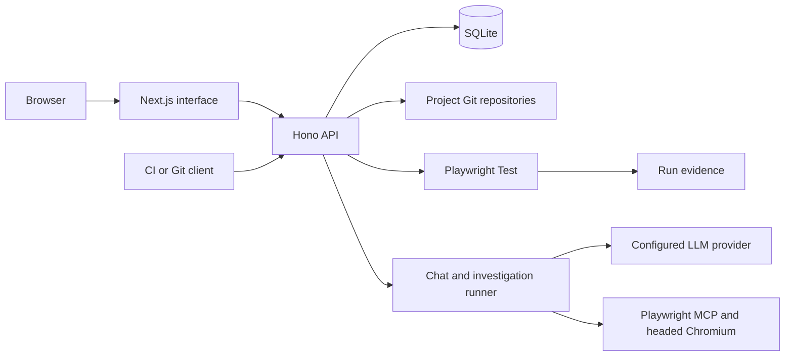

# Architecture

Specbook pairs readable behavior with an executable check. Each Spec has a `spec.yml` contract and a restricted Playwright implementation in `spec.ts`; people review behavior changes, while the agent can investigate execution failures and propose implementation fixes.

## Runtime

The pnpm workspace contains a Next.js 16 frontend and a Hono backend. The frontend serves the interface and forwards `/api` requests to the backend at runtime, including streamed updates, evidence and the live browser connection. Changing the public hostname does not require rebuilding the image.



Playwright Test executes Specs in separate processes. Agent sessions use Playwright MCP with headed Chromium, Xvfb and x11vnc; the backend relays the browser stream to authenticated editors and administrators. The MCP and test packages can require different Chromium revisions, so the browser installation script installs both.

The backend owns scheduling, queues and recovery. One backend process takes a storage lock for the instance; sharing one SQLite/storage directory among multiple active backends is unsupported. Browser execution and agent investigations have separate concurrency limits, each defaulting to two.

## Sources of truth

| Data | Storage and responsibility |
| --- | --- |
| Confirmed project context, Features and Specs | Files in each project's Git repository; the application indexes them in SQLite |
| Accounts, roles, sessions and settings | SQLite application state |
| Conversations, investigations, review decisions and audit events | Persisted application records and chat session files |
| Run status and history | SQLite, with reports and media under `runs/` |
| Project credentials, model credentials and saved browser sessions | Encrypted storage; see [operations](operations.md) for keys and backups |
| Repository remote | A canonical bare Git repository per project, served over Smart HTTP |

`SPECBOOK_STORAGE_DIR` selects the data root. It defaults to `apps/backend/storage` in a source checkout. A project repository contains files such as:

```text
context.yml
features/<feature>/feature.yml
specs/<feature>/<spec>/spec.yml
specs/<feature>/<spec>/spec.ts
```

The repo writer validates changes, creates Git commits and updates the index. The application records human authors on commits made during their requests. A project token authenticates clone, fetch and push; the remote accepts `main`. Run evidence refers to the version that actually ran, so a later edit does not rewrite that history.

## Events and investigations

The project steward is deterministic code. It observes changes and records intentions; it does not ask an LLM to plan repeatedly while nothing has happened.

| Event | Result |
| --- | --- |
| A tracked Spec changes, or a deployment signal arrives | Run applicable Specs under the project's automation policy |
| A Spec fails | Retry once; a pass marks it flaky, while a repeated failure can start triage |
| An investigation lacks access or information | Create a question; an answer or new credentials can resume it |
| A schedule fires or CI requests a batch | Run the selected checks and retain the batch result |
| A person requests coverage analysis or exploration | Start that requested investigation |

The first observation records existing Specs without running them. Invalid Specs show a reason and can be repaired in chat. Coverage analysis and exploratory browsing run on demand.

Investigations reuse the chat turn runner and tools, with persisted state, action logs and internal safeguards against loops. Startup recovery preserves work across backend restarts. Global and project pause controls stop autonomous agent work; retry classification and CI reporting can still finish. Repeated investigations for the same failure and check content are suppressed.

Overview presents questions and proposals under **Needs you**, persistent failures under **Failing**, and batch history under **Recent runs**. Proposals carry diffs and evidence. Applying one rechecks the current files and creates a repository commit; `spec.yml` behavior changes require human approval. Automatic action-locator fixes need administrator opt-in at both instance and project level, Act mode, a passing verification and a trusted approval history. Assertions and action kinds cannot change through that path.

## Capacity planning

For a small pilot, **4 CPU cores, 8 GiB RAM and 20 GiB of free disk** are a suggested starting allocation, not a measured minimum or a throughput benchmark. Chromium sessions, application size and retained evidence determine actual demand. This allocation also excludes the resources of any locally hosted model and the application under test.

Begin with the default concurrency limits and observe memory, CPU and disk during representative runs before increasing them. Reports, screenshots and retained failure media grow with usage; configure [retention and backups](operations.md) early. `/ready` checks the database, storage access, Chromium builds and browser support tools, while `/health` only confirms that the backend answers requests.

See the [security model](security.md) for trust boundaries and provider data, and [development](development.md) for the source layout and verification commands.
